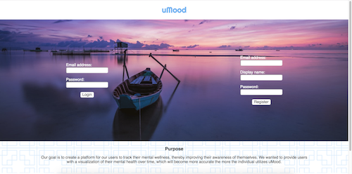
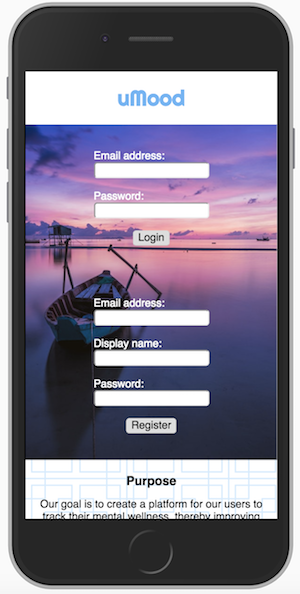
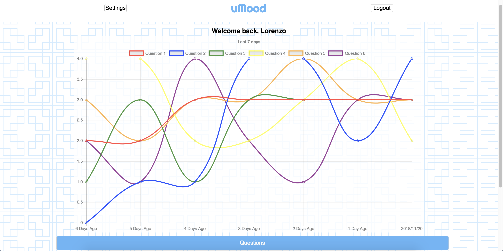
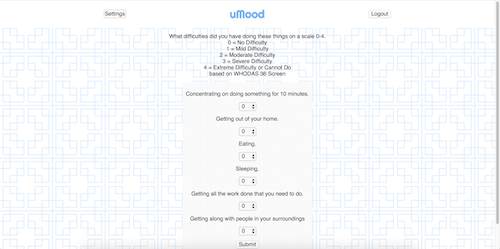
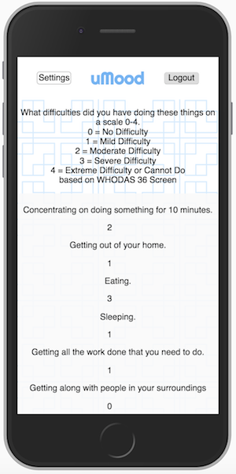
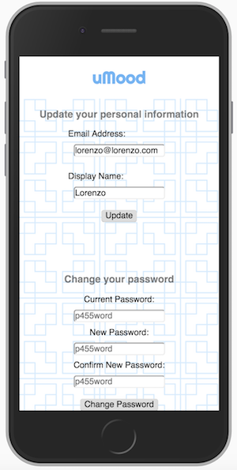

# uMood

- lorem ipsum dolorem

## Technologies Used:
  - JavaScript, Node.js, Express.js, PostgreSQL, HTML5, CSS3

## Roles: 
  - Ed Whelan: Database Management and Backend Development

  - Lorenzo Salvio: Backend Development and Frontend Styling

  - Sam Erickson: HTML Development and Debugging

## Login / Registration

- lorem ipsum dolorem

## User Home

- lorem ipsum dolorem

## Questions

- lorem ipsum dolorem

## Settings

- lorem ipsum dolorem

