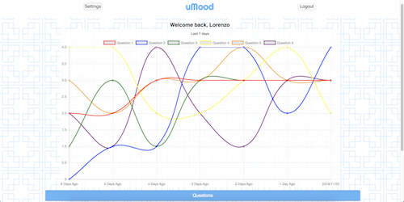
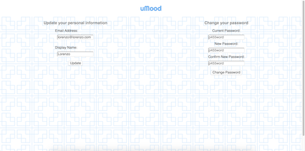

# uMood

  - A web application meant to allow users to track their daily level of wellbeing, based on their daily answers to 6 questions from the WHODAS 36 Depression Screen.  
    - Answers for the previous 6 days and the current day are displayed graphically through a Chart.js line chart, and stored in a PostgreSQL database. 
    - Users also have the ability to create notes to add any thoughts that aren't covered in the questions.
  - The goal was to create an app that could not only be useful for average users day-to-day, but also potentially to be used by psychiatrists and psychologists to have a better idea of how their patients feel on a daily basis.

## Technologies Used:
  - JavaScript, Node.js, Express.js, PostgreSQL, HTML5, CSS3, Chart.js library

## Roles: 
  - Ed Whelan: Database Management and Backend Development

  - Lorenzo Salvio: Backend Development and Frontend Styling

  - Sam Erickson: HTML Development and Debugging

## Login / Registration

- New users can register with an email address, pick a display name, and create a password. Once they register, they will be brought to the user home page.

- Existing users can login with their email address and password, after which they will be redirected to the home page.

## User Home

- Users can view the status of their previous answers on the chart, as well as answer their questions for the day using the "Questions" button. Once the answers are inputted, the chart will be dynamically updated with the new results.

- By clicking on the "Notes" panel, users can add a new set of notes whenever they would like. Notes can be anything from daily thoughts to observed triggers of mood spikes.

- Users are provided with several links to online mental health resources in the "Resources" section.

## Questions

- Accessible once a day, the questions "take the temperature" -- so-to-speak -- on the user's wellbeing for the day. 
- Answers are from 0-4, based on the WHODAS 36 Screen.

## Settings

- Users can easily update their username, the email associated with their account, and their account password.

## Future Additions
- Create different types of user account with varying permissions. 
  - Healthcare providers can customize questions that their patients are asked.

- Create personalized links for users based on their answers, for a more personalized experience. 

- Allow users to add a list of "Support System" contacts who will be alerted if the users' scores are consistently high (indicating a more depressive mood level).
